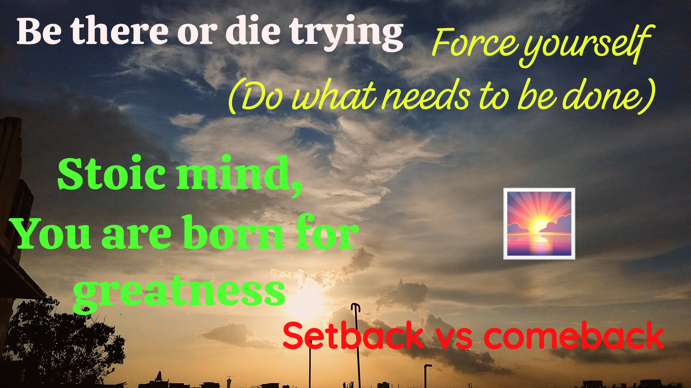

<h1 align="center">
Hi, I'm Priyam Alok!
  </h1> 
<h3 align="center">@priyam0k</h3> 

  
  

  
  

 

## About Me
  - Actuarial Analyst specializing in insurance model development
  - Rust Developer building high-performance systems
  - Portfolio: [ipriyam.com](https://ipriyam.com)

## I'm interested in
  - Actuarial Science, Insurance Pricing & Reserving
  - Rust Development, Systems Programming
  - P&C Insurance Analytics, Loss Ratio Analytics
  - Risk Management, 
  - Data Pipelines, ETL Systems
  - Machine Learning for Insurance
  - Customer Segmentation & Behavioral Analytics

## I'm currently learning
  - Advanced Rust for High-Performance Computing
  - Actuarial Model Development
  - Deep Learning for Risk Assessment
  - Cloud-Native Insurance Systems

## My Favorite Tools

### Programming Languages

### Frameworks and Libraries

    
    
    
    
    

### Actuarial & Analytics Projects

- [Pricing Simulation Case Competition](https://ipriyam.com/pricing-simulation-case-competition.html)
- [Parametric Crop Insurance](https://ipriyam.com/parametric-crop-insurance-project.html)
- [P&C Chain Ladder Reserving](https://ipriyam.com/p&c-chain-laddere-reserving.html)
- [Loss Ratio Dashboards](https://ipriyam.com/loss-ratio-dashboards.html)
- [Customer Segmentation](https://ipriyam.com/customer-segmentation.html)
- [Claim Data Pipeline](https://ipriyam.com/claim-data-pipeline.html)
- [Impact of Electric Vehicles Report](https://ipriyam.com/impact-of-electric-vehicles-report)

## Connect with Me

   

I'm looking to collaborate on Actuarial Model Development, Insurance Analytics, Rust Projects, and Data Engineering Systems.

### GitHub Stats
<table class="center" style="width:100%;">
  <tr>
    <td align="center">
  
    </td>
    <td align="center">
  
</td>
  </tr>
</table>

<h1 align="center">
  
</h1>

  

<!---
priyam0k/priyam0k is a special repository because its README.md (this file) appears on your GitHub profile.
You can click the Preview link to take a look at your changes.
--->
