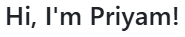

<h1 align="center">
  
</h1>
<h3 align="center">@priyam0k</h3>

  
  

### about

- actuarial analyst and model development
- non-life pricing, reserving, regulatory applications and defi
- low-latency systems

*student of life.*

### tools

`python` · `r` · `sql` · `rust` · `polars` · `pandas` · `numpy` · `scikit-learn`

### links

   

### stats

<table class="center" style="width:100%;">
  <tr>
    <td align="center">
      
    </td>
    <td align="center">
      
    </td>
  </tr>
</table>

<h1 align="center">
  
</h1>

<!---
priyam0k/priyam0k is a special repository because its README.md (this file) appears on your GitHub profile.
You can click the Preview link to take a look at your changes.
--->
